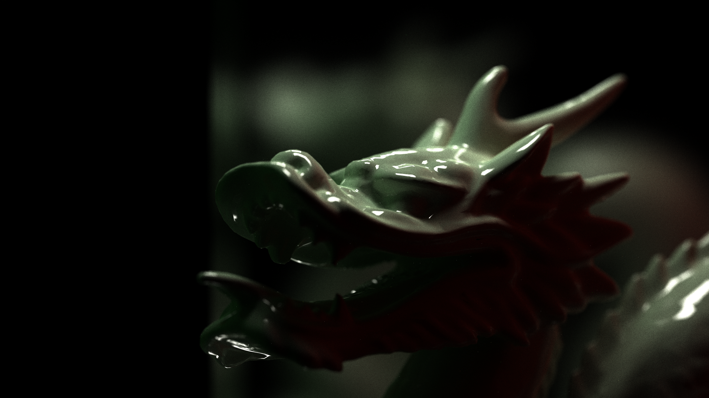
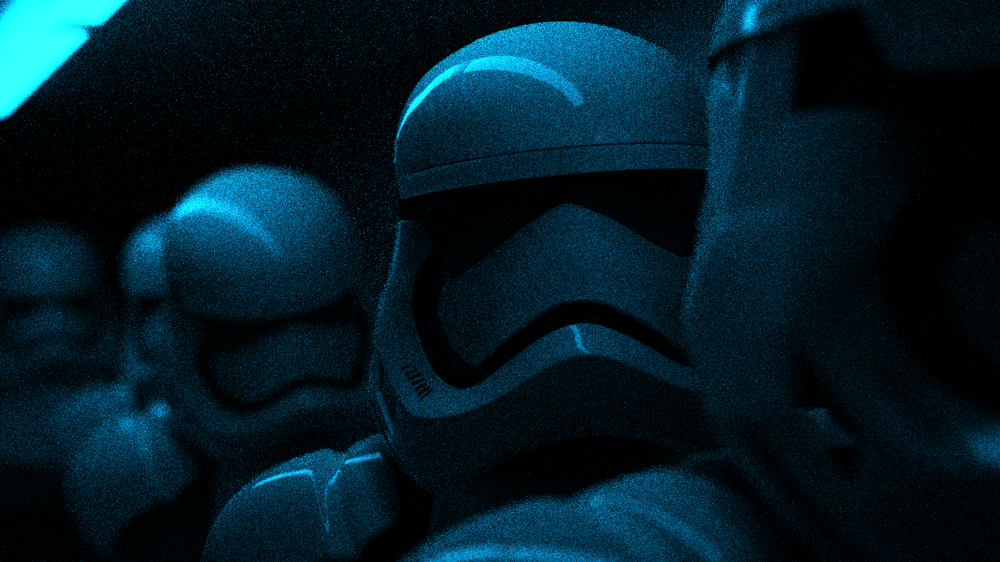
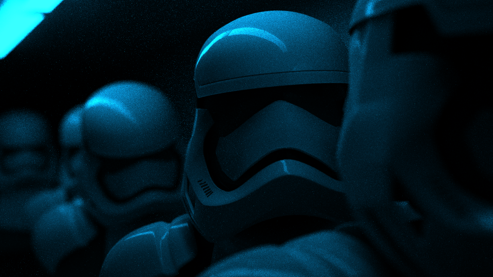
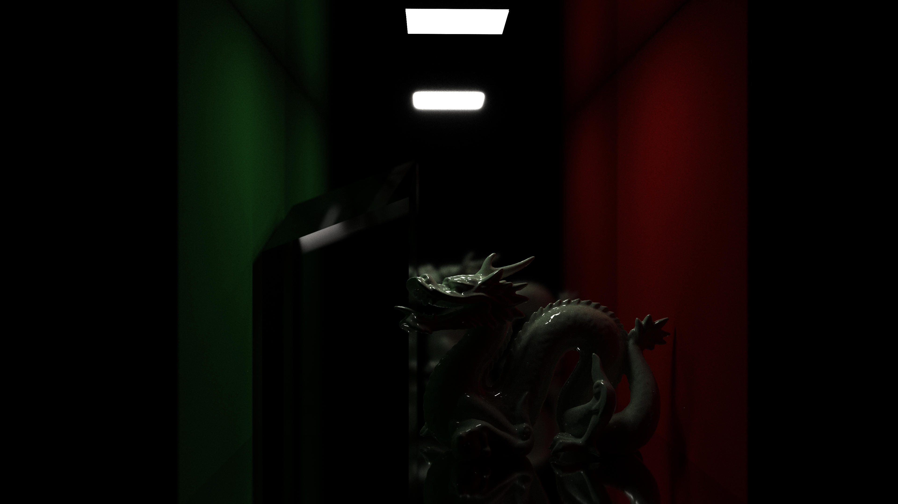
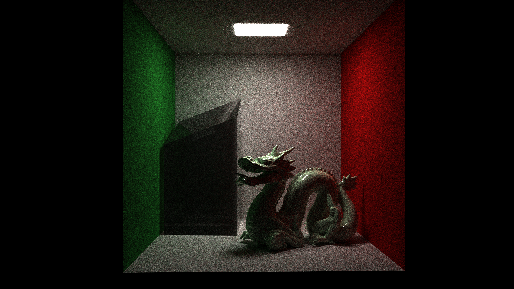
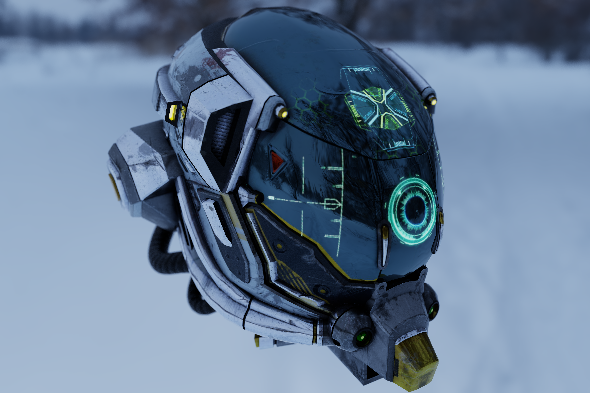
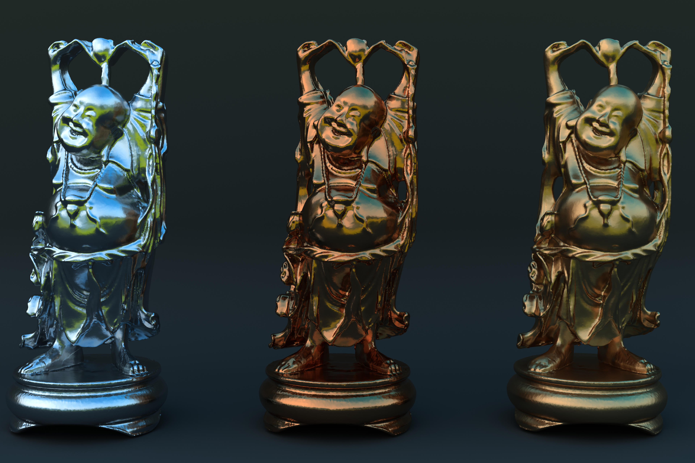
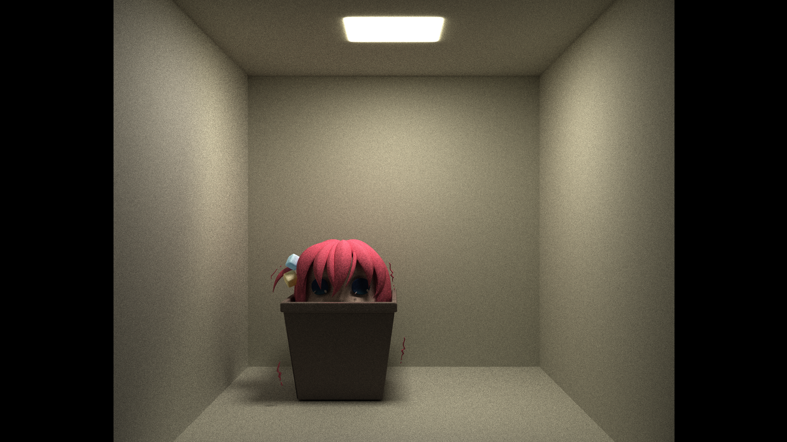

# NBPT

A PBR GPU compute shader path tracing application written in C++ and Slang.

This project is a practical application of the modern offline rendering framework outlined by the PBRT textbook.
It is written in  c++ and Slang, and can render using OpenGL or Vulkan. A DirectX 12 renderer is in development.

*Dielectric GGX multiscatter. 3840 x 2160, 1024 samples*

## Features

- Real-time path traced scene editor
- Progressive sample accumulation
- Physically based metallic-roughness materials
- GGX microfacet reflection
- GGX VNDF importance sampling
- NEE MIS for emmissive sources
- Sphere, triangle, and quad primitives
- glTF model loading
- Meshes and mesh instancing
- Editable material assignments
- Custom BVH with TLAS and BLAS acceleration structures
- Iterative GPU BVH traversal
- Emmissive light sampling
- HDR environment lighting
- Depth of field
- SSAA
- Offline/final rendering at configurable resolution, sample count, and bounce depth

|                   No Direct Light Sampling                    |                 With Direct Light Sampling                  |
|:-------------------------------------------------------------:|:-----------------------------------------------------------:|
|  |  |
*Both images render at 1920 x 1080, 64 samples*

*Cornell box with no NEE. 3840 x 2160, 1024 samples*

*Cornell box with brighter lighting. 2560 x 1440, 1024 samples*

*Texture loading. 3840 x 2560, 512 samples*

*Metals. 2560 x 1440, 1024 samples*

*Another Cornell box. 3840 x 2160, 1024 samples*

## TODO

- Add Vulkan rendering path using Vulkan acceleration structures
- Change from median split bvh to an SAH BVH construction
- Volumetrics
- Next event estimation for HDRIS
- Clean up main
- Restructure shader pipeline to support spectral rendering
- Add more debug features/performance metrics
- Implement DirectX 12 renderer

## References
### Texbooks and Implementation Resources

- [Physically Based Rendering: From Theory to Implementation](https://pbr-book.org/) — Matt Pharr, Wenzel Jakob, and Greg Humphreys
- [Ray Tracing in One Weekend Series](https://raytracing.github.io/books/RayTracingInOneWeekend.html) — Peter Shirley, Trevor David Black, Steve Hollasch
- [LearnOpenGL](https://learnopengl.com/) — Joey de Vries
- [Cycles Renderer Documentation](https://developer.blender.org/docs/features/cycles/) — Blender Foundation

### Papers
- [Ray Tracing Deformable Scenes using
  Dynamic Bounding Volume Hierarchies](https://www.sci.utah.edu/~wald/Publications/2007/BVH/download/togbvh.pdf)— Ingo Wald, Solomon Boulos, and Peter Shirley
- [Enterprise PBR Shading Model 2025x](https://dassaultsystemes-technology.github.io/EnterprisePBRShadingModel/spec-2025x.md.html#components) — Dassault Systèmes

### Assets

- [Stanford models](https://graphics.stanford.edu/data/3Dscanrep/) — Stanford University
- [Damaged Helmet](https://github.com/KhronosGroup/glTF-Sample-Assets/blob/main/Models/Models.md) — KhronosGroup
- [A Beautiful Game](https://github.com/KhronosGroup/glTF-Sample-Assets/blob/main/Models/Models.md)— KhronosGroup
- [Stormtrooper scene](https://blendswap.com/blend/13953) — ScottGraham
- [Bocchi](https://sketchfab.com/3d-models/bocchi-rubbish-bin-1bec59896aa64fdda06b2ad425e164ed)
- [HDRIs](https://polyhaven.com/) — Poly Haven

